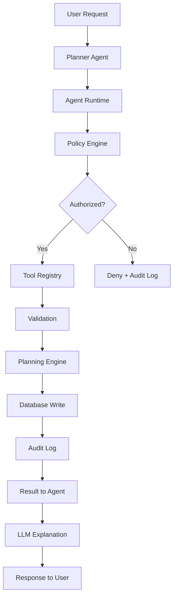

# PlanOS

**A Reliable Agent Runtime for Enterprise Planning**

PlanOS is a production-quality backend system that demonstrates how to build reliable AI agents for enterprise planning workflows. It treats the LLM as an untrusted probabilistic component and keeps all business-critical operations deterministic and secure.

## Problem

Enterprise planning involves complex financial calculations, multi-dimensional data analysis, and scenario modeling. While LLMs are excellent at understanding natural language and generating explanations, they should never:

- Directly manipulate databases
- Execute arbitrary code
- Perform financial calculations (hallucination risk)
- Make authorization decisions

## Architecture

PlanOS separates concerns into two distinct layers:

### Probabilistic Layer (LLM)
- Natural language understanding
- Intent extraction
- Action proposal (not execution)
- Result explanation

### Deterministic Layer (Runtime)
- All database writes
- Financial calculations
- Authorization and policies
- Validation and audit logging



## Tech Stack

- **Backend**: Python 3.12+, FastAPI, Pydantic v2
- **Database**: PostgreSQL 16, SQLAlchemy 2.x, Alembic
- **Cache/Queue**: Redis, Celery
- **Auth**: JWT, RBAC
- **Observability**: OpenTelemetry, structured logging
- **Infrastructure**: Docker, GitHub Actions, Terraform, Kubernetes

## Quick Start

### Prerequisites

- Docker and Docker Compose
- Python 3.12+ (for local development)

### Docker Setup

```bash
git clone <repo-url>
cd PlanOS
docker compose up -d
docker compose exec api alembic upgrade head
docker compose exec api python scripts/seed_data.py
# API available at http://localhost/docs
```

### Local Development

```bash
make install
docker compose up -d postgres redis
make migrate
make seed
make dev
# In another terminal:
make worker
# In another terminal:
make worker
```

## API Examples

### Authentication

```bash
# Register
curl -X POST http://localhost/api/v1/auth/register \
  -H "Content-Type: application/json" \
  -d '{"email":"user@acme.com","password":"password123","full_name":"John","organization_slug":"acme-corp"}'

# Login
curl -X POST http://localhost/api/v1/auth/login \
  -H "Content-Type: application/json" \
  -d '{"email":"admin@acme.com","password":"password123"}'
```

### Plans

```bash
curl -X POST http://localhost/api/v1/plans \
  -H "Authorization: Bearer $TOKEN" \
  -H "Content-Type: application/json" \
  -d '{"name":"2025 Plan","description":"Annual plan"}'
```

### Scenarios

```bash
curl -X POST http://localhost/api/v1/scenarios \
  -H "Authorization: Bearer $TOKEN" \
  -H "Content-Type: application/json" \
  -d '{
    "name": "Q4 Demand Surge",
    "base_plan_id": "...",
    "changes": {"demand_growth": 0.15, "marketing_budget_multiplier": 1.10}
  }'

# Run asynchronously
curl -X POST http://localhost/api/v1/scenarios/{id}/run \
  -H "Authorization: Bearer $TOKEN"
```

## Security Model

- **Roles**: ADMIN, PLANNER, ANALYST, VIEWER
- **Tenant Isolation**: Every query scoped by organization_id
- **Optimistic Concurrency**: Version-based conflict detection
- **Audit Logging**: All sensitive operations recorded immutably

## Planning Engine

All calculations are deterministic pure functions:
- `revenue = units × price`
- `profit = revenue - cost - operating_expenses`
- `capacity_utilization = demand / capacity × 100`

The LLM never performs calculations - it only proposes actions.

## Testing

```bash
make test          # All tests
make test-unit     # Unit tests only
make test-security # Security-focused tests
```

## License

MIT

```
